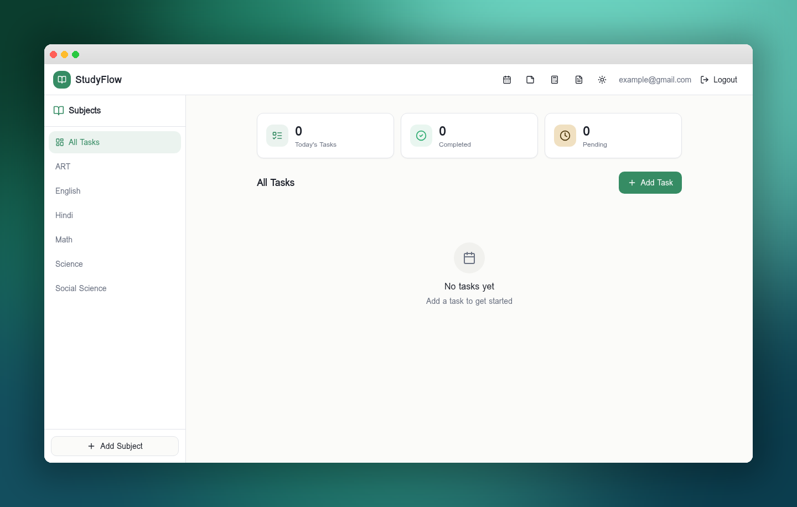
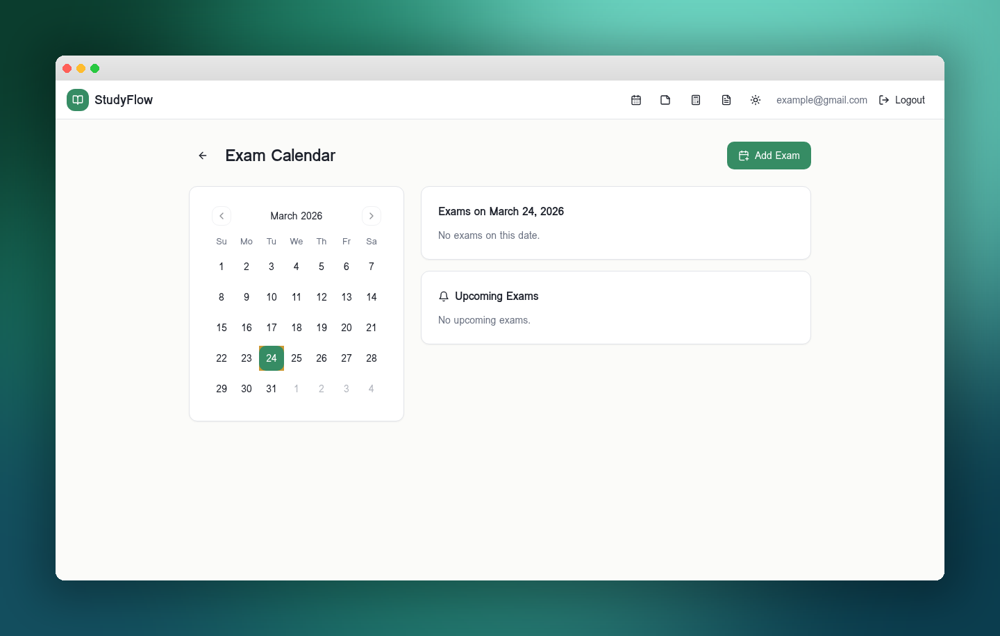

# 📚 Student Study Planner

A modern study management application built for students to organize tasks, track exams, store notes, and manage study materials — all in one place.

## 📸 Screenshots

### Dashboard


### Exam Calendar


## ✨ Features

- **📋 Task Management** — Add, track, and complete study tasks with subject tagging and date/time scheduling
- **📅 Exam Calendar** — Set exam dates and get smart notifications (Today / Tomorrow alerts on dashboard)
- **📝 Notepad** — Write and save study notes linked to your account
- **📄 PDF Storage** — Upload and organize PDF study materials by subject
- **📊 Dashboard Stats** — Visual overview of your tasks, completion rates, and upcoming exams
- **🧮 Calculator** — Built-in calculator for quick calculations
- **🏆 Achievement Animations** — Confetti celebrations when you complete tasks
- **🌗 Dark / Light Mode** — Toggle between themes for comfortable studying
- **🔐 Authentication** — Secure login and signup with email verification

## 🛠️ Tech Stack

- **Frontend:** React 18, TypeScript, Vite
- **Styling:** Tailwind CSS, shadcn/ui
- **Backend:** Lovable Cloud (Supabase)
- **State Management:** TanStack React Query
- **Routing:** React Router v6
- **Charts:** Recharts
- **Animations:** Framer Motion, Canvas Confetti

## 🚀 Getting Started

### Prerequisites

- Node.js 18+ 
- npm or bun

### Installation

```bash
# Clone the repository
git clone <your-repo-url>
cd student-study-planner

# Install dependencies
npm install

# Start the development server
npm run dev
```

The app will be available at `http://localhost:5173`.

## 📁 Project Structure

```
src/
├── components/       # Reusable UI components
│   ├── ui/           # shadcn/ui base components
│   ├── TaskList.tsx   # Task management
│   ├── ExamNotifications.tsx  # Exam alerts
│   ├── Notepad.tsx    # Notes editor
│   ├── PdfStorage.tsx # PDF file manager
│   └── ...
├── contexts/         # React contexts (Auth)
├── hooks/            # Custom hooks (useTasks, useExams, useSubjects)
├── pages/            # Route pages (Dashboard, Calendar, Auth)
└── integrations/     # Backend client setup
```

## 📄 License

This project is open source and available under the [MIT License](LICENSE).
